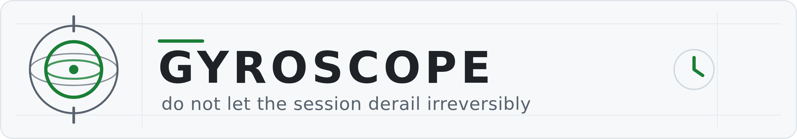
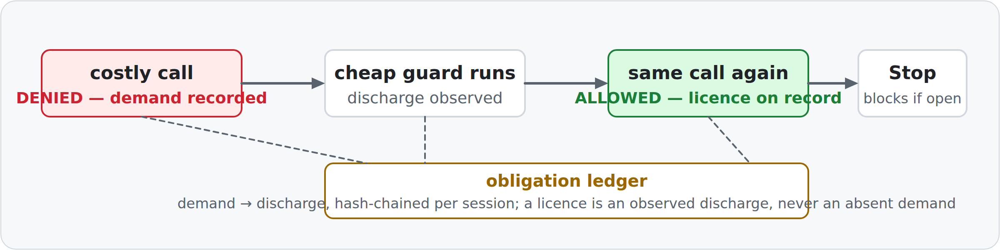

# Gyroscope

<picture>
  <source media="(prefers-color-scheme: dark)" srcset="docs/img/gyroscope-hero-dark.png">
  
</picture>

**One purpose: do not let the session derail irreversibly.**

The drift it opposes is the one where the DEFAULT is the unhealing issue. Not where an act
is dangerous, not where something ends badly — where *doing nothing* lands you somewhere that
does not heal. `rm -rf build/` is a moment; the state it leaves is one where the evidence of what
was there is gone, and you cannot correct what you cannot reconstruct. The worst of it is when
the correct path is unreachable without reversing the default — a green check is the pure case:
greenness is what ends the run, so investigating requires first reversing "it's green."

## How it heals: reversal

Gyroscope reverses that default. Where the session would otherwise capsize — the costly act just
runs, the cheap guard is forgotten — it makes denial the resting state, so what happens when
nobody acts is the safe fate instead of the unhealing one. The method is a repricing, not a
prohibition:

| | the costly call | the guard |
|---|---|---|
| before | free — it just runs | takes effort, and is forgotten |
| after | costs one cheap call on record | free — denial is the resting state |

Same object, two reachable fates, the cost assignment swapped, nothing added. Forgetting now
produces the safe outcome, so the rule is not defeated by ordinary forgetting, and its failure
mode is loud rather than silent: the thing you wanted requires an artifact that is either there
or is not.

## Why a gyroscope

A session is a flow — the default toward *proceed, it looks complete, keep going* reasserts at
every turn, not once at entry, so one instruction at the entrance is spent by turn three. What
holds a flow is a gyroscope: spun up once and then continuously present, opposing drift with
matched force at every moment, requiring no attention and no trigger. It does not choose the
direction — it prevents tumbling off the axis you set. That is why this is a hook registered on
every event rather than something that runs at session start, and why there is a ledger: the
ledger is the stored state that keeps the gyroscope spun up across turns, so each turn inherits
the opposition instead of re-earning it.

## The mechanism

<picture>
  <source media="(prefers-color-scheme: dark)" srcset="docs/img/ledger-flow-dark.png">
  
</picture>

A `PreToolUse` deny records a **demand**; a later call matching the clause's guard records a
**discharge**; at `Stop` anything still open blocks. A licence is an **observed discharge**,
never an absent demand — the absence of evidence is never treated as permission.

This package carries two arms:

- **`plugin/`** — the dispatcher (`gyroscope/`), the shipped clause table
  (`gyroscope/clauses.json`, 24 admitted clauses), the POSIX shim (`hooks/dispatch.sh`), and hook
  manifests for both supported hosts. Every fingerprint is an exact predicate over command, tool,
  or path identity — no clause infers intent from prose. The hook fails open: if the dispatcher
  cannot run, it stays silent rather than blocking the host.
- **`skill/`** — `SKILL.md` plus session hooks, wired via `hooks/settings.fragment.json`. This
  arm covers the guards that leave no mark in a call sequence (clarify before committing to a
  plan, confirm a checker can fail, run the entrypoint a user runs);
  `gyroscope-sessionstart.sh` prints `SKILL.md` into context at session start.

### Install

- **Claude Code** — `hooks/hooks.json` is already the right shape; the bundle registers via
  `.claude-plugin/plugin.json`. Zero extra action.
- **Codex** — copy `hooks/hooks.codex.json` to the location Codex reads (`.codex/hooks.json` in a
  project).

### Manual bypass

If serialized `tool_input` contains `gyroscope-allow:` followed by non-whitespace text,
`PreToolUse` returns an empty decision before evaluating any clause.

## Evidence

`python3 eval/replay.py` from the repository root replays recorded sessions through the real
dispatcher and proves the hook speaks at or before the moment each session went wrong — and stays
silent on the control, and re-allows the same call after the guard. Standard library only.

## Why this is not a deny list

[Ward](https://github.com/Clear-Sights/ward), a sibling plugin, is a deny list: its verdict is a
pure function of one event. For a matching costly call, Gyroscope's decision
is a function of `(event, ledger)`: it is denied before the clause's guard discharge and admitted
afterward. Gyroscope does not substitute a safer action and does not remove a fate — it changes
whether the *same* call executes now or waits until its licensing evidence exists.

## Honest limitations

- **The ledger constrains an honest-but-forgetful agent, not a forging one.** Its hash chain
  detects altered rows and broken or missing hashes, but not deletion of a valid tail; a writer
  able to forge rows can recompute hashes.
- **A licence is scoped to its clause and session** — one observed guard licenses later
  matching calls for that clause anywhere in the same session, not just against the same file,
  branch, or command.

## License

Apache-2.0 — see [LICENSE](LICENSE).
